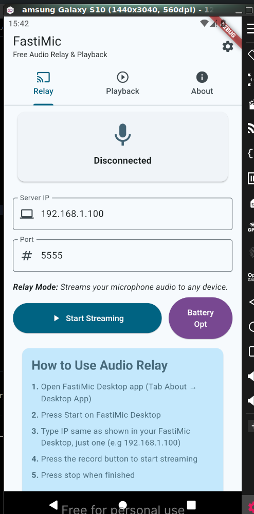

# FastiMic – Free Audio Relay & Playback

**FastiMic** is a powerful, free audio relay and playback application that allows you to stream your microphone audio to any device over WiFi or USB connection. Perfect for presentations, streaming, recording, or any scenario where you need to relay audio from your phone to a computer or other devices.

---

## 🌟 Welcome to FastiMic

Transform your mobile device into a wireless microphone! FastiMic enables seamless audio streaming between your phone and computer, making it perfect for content creators, presenters, and anyone who needs flexible audio solutions.

---

## 📱 Download FastiMic

FastiMic is available across multiple platforms:

| Platform       | Download                                                                           | Requirements  |
| -------------- | ---------------------------------------------------------------------------------- | ------------- |
| 🖥️ **Windows** | ON-PROCESS                                                                         | Windows 10+   |
| 🍎 **macOS**   | ON-PROCESS                                                                         | macOS 10.15+  |
| 🐧 **Linux**   | [Download Receiver](https://github.com/Flagodna-Developer/fastimic/releases)       | Ubuntu 18.04+ |
| 📱 **Android** | [Google Play](https://play.google.com/store/apps/details?id=com.flagodna.fastimic) | Android 6.0+  |
| 🍎 **iOS**     | ON-PROCESS                                                                         | iOS 12.0+     |

---

## ✨ Why You'll Love FastiMic

### 🔖 **Audio Relay**

Stream your phone's microphone audio to any device in real-time. Whether you're using WiFi or USB connection, FastiMic ensures crystal-clear audio transmission with minimal latency. Perfect for:

- Live streaming and content creation
- Presentations and public speaking
- Recording sessions
- Gaming and voice chat

### 📚 **Audio Playback**

Local audio playback functionality allows you to monitor and control your audio output directly from your device. Features include:

- Real-time audio monitoring
- Volume control and adjustment
- Multiple output options (wired/wireless)
- Low-latency playback

---

## 🚀 Get Started

### How to Use Audio Relay

1. **Setup Desktop App**

   - Open FastiMic Desktop app (Tab About → Desktop App)
   - Press Start on FastiMic Desktop

2. **Connect Your Mobile Device**
   - Type the IP address shown in your FastiMic Desktop (e.g., 192.168.1.100)
   - Press the record button to start streaming
   - Press stop when finished

### Better Usage with USB Connection

For improved stability and lower latency:

1. **Enable Developer Mode**

   - Go to Settings → About Phone
   - Tap Build Number 7 times to enable Developer mode

2. **Setup USB Debugging**

   - Enable USB debugging in Developer options
   - Setup ADB on your Desktop computer

3. **Connect via USB**
   - Connect phone with Desktop over USB cable
   - Run in terminal: `adb reverse tcp:5555 tcp:5555`
   - Connect to IP: 127.0.0.1 in the mobile app

### How to Use Playback

1. Press the play button to start local playback
2. Adjust your device volume as needed
3. Press stop when finished

#### ⚠️ Important Audio Setup Tips

**Caution**: Improper audio routing may result in:

- Feedback loops
- Echo or latency issues
- No audible output

**🎙️ Microphone Setup Tips**:

- Separate input and output audio channels if possible
- Use system sound settings to configure audio sources

**🎧 Recommended Audio Output Options**:

- **Wired**: Use a 3.5mm headset with microphone support
- **Wireless**: TWS (True Wireless Stereo) earbuds work well
- **Bluetooth**: Pair with a compatible speaker or headset

---

## 📸 Screenshots

---

## 🔗 More Resources

| Link                                                                                  | Description                    |
| ------------------------------------------------------------------------------------- | ------------------------------ |
| [⭐ Give Rating](https://play.google.com/store/apps/details?id=com.flagodna.fastimic) | Your feedback helps us improve |
| [💻 Project GitHub](https://github.com/Flagodna-Developer/fastimic)                   | See how this app is built      |

---

## 🙌 Behind FastiMic

**Creator & Main Developer**: [Cahyanudien AS](https://github.com/cas8398)

---

## 🆘 Support & Feedback

Need help or want to share feedback? We're here to help!

- 📧 **Email**: flagodna.com@gmail.com
- 🐛 **Bug Reports**: [GitHub Issues](https://github.com/Flagodna-Developer/fastimic/issues)
- 💡 **Feature Requests**: [GitHub Discussions](https://github.com/Flagodna-Developer/fastimic/discussions)

---

## 📄 License

This project is licensed under the GNU General Public License v3.0 - see the [LICENSE](LICENSE) file for details.

---

## 🤝 Contributing

We welcome contributions! Please feel free to submit a Pull Request. For major changes, please open an issue first to discuss what you would like to change.

---

_Made with ❤️ by the FastiMic Team_
